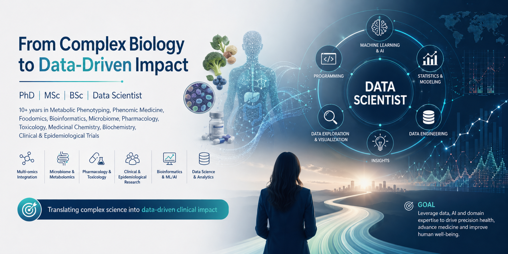

# Dr. José Iván Serrano-Contreras  

**Senior Data Scientist | Applied Machine Learning | Complex & High-Dimensional Data**

---

  

---

## 👋 About Me

I am a senior data scientist with 10+ years of experience working with **complex, high-dimensional datasets**, applying statistical modeling, machine learning, and data visualization to extract actionable insights.

My background in life-science data gives me a strong foundation in **rigorous modeling, feature engineering, and explainable analytics**, with proven experience translating noisy real-world data into reliable decisions.

---

## 📊 What I Do

- Data exploration and feature engineering
- Statistical modeling and hypothesis testing
- Supervised and unsupervised machine learning
- Model interpretation and validation
- Data storytelling for technical and non-technical stakeholders
- End-to-end analytical pipelines

---

## 🧠 Data Science Skills

- Multivariate analysis (PCA, clustering, regression)
- Machine learning (classification, regression, dimensionality reduction)
- Network and graph analysis
- Experiment design and evaluation
- Reproducible research and analytics workflows

---

## 🛠 Tech Stack

**Languages & Tools**
- Python (pandas, numpy, scikit-learn, matplotlib)
- R (tidyverse, ggplot2, modeling)
- SQL
- MATLAB

---

## 🌍 Open to Roles In

- Senior Data Scientist
- Applied Scientist
- Machine Learning Scientist
- Analytics Lead
- Data Science Consultant

---

## 🔗 Connect

- 📧 jserracont@gmail.com  
- 💼 LinkedIn: https://www.linkedin.com/in/jose-ivan-serrano-contreras/
- 🧬 ORCID: https://orcid.org/0000-0001-8669-7571 

> *From messy data to meaningful insight.*
